# Diagrama de Clases - Vinilos Mobile

## Arquitectura MVVM - Modelo de Dominio

```mermaid
classDiagram
    %% ========== CAPA DE PRESENTACIÓN (ViewModels) ==========
    class AlbumViewModel {
        -AlbumRepository albumRepository
        +Flow~List~Album~~ albums
        +refreshAlbums()
        +getAlbumById(id: Int) Album?
    }
    
    class ArtistViewModel {
        -ArtistRepository artistRepository
        +Flow~List~Artist~~ artists
        +refreshArtists()
        +getArtistById(id: Int) Artist?
    }
    
    class CollectorViewModel {
        -CollectorRepository collectorRepository
        +Flow~List~Collector~~ collectors
        +refreshCollectors()
        +getCollectorById(id: Int) Collector?
    }

    %% ========== CAPA DE DATOS (Repositories) ==========
    class AlbumRepository {
        -AlbumService albumService
        -AlbumDao albumDao
        -Map~Int, Album~ albumsInMemory
        -boolean isInitialized
        +getAllAlbums() Flow~List~Album~~
        +getAlbumById(id: Int) Album?
        +refreshAlbums()
    }
    
    class ArtistRepository {
        -ArtistService artistService
        -ArtistDao artistDao
        -Map~Int, Artist~ artistsInMemory
        -boolean isInitialized
        +getAllArtists() Flow~List~Artist~~
        +getArtistById(id: Int) Artist?
        +refreshArtists()
    }
    
    class CollectorRepository {
        -CollectorService collectorService
        -CollectorDao collectorDao
        -Map~Int, Collector~ collectorsInMemory
        -boolean isInitialized
        +getAllCollectors() Flow~List~Collector~~
        +getCollectorById(id: Int) Collector?
        +refreshCollectors()
    }

    %% ========== CAPA DE DATOS (Services - Retrofit) ==========
    class AlbumService {
        <<interface>>
        +getAllAlbums() List~AlbumApiResponse~
        +getAlbumById(id: Int) AlbumApiResponse
    }
    
    class ArtistService {
        <<interface>>
        +getAllArtists() List~ArtistApiResponse~
        +getArtistById(id: Int) ArtistApiResponse
    }
    
    class CollectorService {
        <<interface>>
        +getAllCollectors() List~CollectorApiResponse~
        +getCollectorById(id: Int) CollectorApiResponse
    }

    %% ========== CAPA DE DATOS (DAOs - Room) ==========
    class AlbumDao {
        <<interface>>
        +getAllAlbums() Flow~List~Album~~
        +getAlbumById(id: Int) Album?
        +insertAlbums(albums: List~Album~)
        +deleteAll()
    }
    
    class ArtistDao {
        <<interface>>
        +getAllArtists() Flow~List~Artist~~
        +getArtistById(id: Int) Artist?
        +insertArtists(artists: List~Artist~)
        +deleteAll()
    }
    
    class CollectorDao {
        <<interface>>
        +getAllCollectors() Flow~List~Collector~~
        +getCollectorById(id: Int) Collector?
        +insertCollectors(collectors: List~Collector~)
        +deleteAll()
    }

    %% ========== MODELOS DE DOMINIO ==========
    class Album {
        +Int id
        +String name
        +String description
        +String cover
        +String releaseDate
        +String genre
        +String recordLabel
        +List~Int~ artists
        +Int tracksCount
        +Int performersCount
        +Int commentsCount
        +List~Track~ tracks
        +List~Performer~ performers
        +List~Comment~ comments
    }
    
    class Track {
        +Int id
        +String name
        +String duration
    }
    
    class Performer {
        +Int id
        +String name
        +String image
        +String description
        +String? birthDate
        +String? creationDate
    }
    
    class Comment {
        +Int id
        +String description
        +Int rating
    }
    
    class Artist {
        +Int id
        +String name
        +String birthDate
        +String image
        +String description
        +Int albumsCount
        +Int prizesCount
        +List~ArtistAlbum~ albums
        +List~ArtistPrize~ performerPrizes
    }
    
    class ArtistAlbum {
        +Int id
        +String name
        +String cover
        +String releaseDate
        +String description
        +String genre
        +String recordLabel
    }
    
    class ArtistPrize {
        +Int id
        +String premiationDate
    }
    
    class Collector {
        +Int id
        +String name
        +String telephone
        +String email
        +String? image
        +Int commentsCount
        +Int favoritesCount
        +Int albumsCount
        +List~CollectorComment~ comments
        +List~FavoritePerformer~ favoritePerformers
        +List~CollectorAlbum~ collectorAlbums
    }
    
    class CollectorComment {
        +Int id
        +String description
        +Int rating
    }
    
    class FavoritePerformer {
        +Int id
        +String? name
        +String? image
        +String? description
        +String? birthDate
        +String? creationDate
        +getDate() String
    }
    
    class CollectorAlbum {
        +Int id
        +String name
        +String cover
        +String releaseDate
    }

    %% ========== RELACIONES ==========
    %% ViewModels -> Repositories
    AlbumViewModel --> AlbumRepository : uses
    ArtistViewModel --> ArtistRepository : uses
    CollectorViewModel --> CollectorRepository : uses
    
    %% Repositories -> Services
    AlbumRepository --> AlbumService : uses
    ArtistRepository --> ArtistService : uses
    CollectorRepository --> CollectorService : uses
    
    %% Repositories -> DAOs
    AlbumRepository --> AlbumDao : uses
    ArtistRepository --> ArtistDao : uses
    CollectorRepository --> CollectorDao : uses
    
    %% Repositories -> Models
    AlbumRepository --> Album : manages
    ArtistRepository --> Artist : manages
    CollectorRepository --> Collector : manages
    
    %% Composición de modelos
    Album *-- Track : contains
    Album *-- Performer : contains
    Album *-- Comment : contains
    Artist *-- ArtistAlbum : contains
    Artist *-- ArtistPrize : contains
    Collector *-- CollectorComment : contains
    Collector *-- FavoritePerformer : contains
    Collector *-- CollectorAlbum : contains
```

## Notas

- **Patrón MVVM**: ViewModels exponen datos reactivos (Flow) a la UI
- **Patrón Repository**: Abstrae el origen de datos (API + Cache local)
- **Patrón Service Adapter**: Retrofit para consumo de API REST
- **Room Database**: Persistencia local con DAOs
- **Inyección de Dependencias**: Dagger 2 (no mostrado en diagrama)

