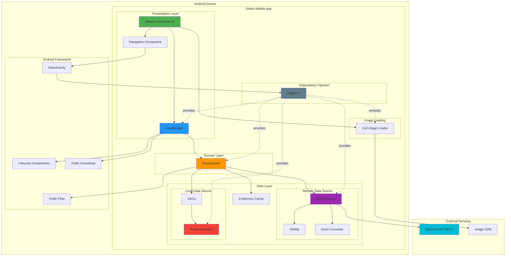

# Diagrama de Componentes - Vinilos Mobile

## Arquitectura de Componentes



## Descripción de Componentes

### **Presentation Layer** (Capa de Presentación)
- **Jetpack Compose UI**: Framework declarativo para construir la interfaz
- **Navigation Component**: Gestión de navegación entre pantallas
- **ViewModels**: Gestión de estado y lógica de presentación (MVVM)

### **Domain Layer** (Capa de Dominio)
- **Repositories**: Abstracción del origen de datos, implementa patrón Repository

### **Data Layer** (Capa de Datos)

#### Remote Data Source
- **Retrofit Client**: Cliente HTTP para consumo de API REST
- **OkHttp**: Cliente HTTP subyacente con interceptores
- **Gson Converter**: Serialización/deserialización JSON

#### Local Data Source
- **Room Database**: Base de datos SQLite con ORM
- **DAOs**: Data Access Objects para operaciones CRUD

#### Cache
- **In-Memory Cache**: Caché en memoria (Map) para datos enriquecidos

### **Dependency Injection**
- **Dagger 2**: Framework de inyección de dependencias en tiempo de compilación

### **Image Loading**
- **Coil**: Librería de carga de imágenes optimizada para Compose

### **Android Framework**
- **MainActivity**: Actividad principal que contiene el NavHost
- **Lifecycle Components**: Gestión del ciclo de vida
- **Kotlin Coroutines**: Programación asíncrona
- **Kotlin Flow**: Streams reactivos de datos

### **External Services**
- **Backend API REST**: API de Vinilos (https://back-vinilos-q6yc.onrender.com)
- **Image CDN**: Servidor de imágenes (i.pravatar.cc, i.pinimg.com)

## Flujo de Datos

### Lectura de Datos (Read Flow)
```
1. UI solicita datos al ViewModel
2. ViewModel solicita Flow al Repository
3. Repository:
   a. Consulta caché local (Room)
   b. Si no está inicializado, consulta API (Retrofit)
   c. Guarda en Room y en memoria
   d. Emite Flow con datos actualizados
4. ViewModel expone Flow a la UI
5. UI se recompone automáticamente
```

### Carga de Imágenes
```
1. UI solicita imagen a Coil
2. Coil descarga desde CDN
3. Coil cachea en disco y memoria
4. Coil muestra imagen en UI
```

## Tecnologías Clave

| Componente | Tecnología | Versión |
|------------|------------|---------|
| UI | Jetpack Compose | 1.7.5 |
| Navegación | Compose Navigation | 2.8.4 |
| Arquitectura | MVVM + Repository | - |
| DI | Dagger 2 | 2.51.1 |
| HTTP Client | Retrofit + OkHttp | 2.9.0 / 4.12.0 |
| JSON | Gson | 2.10.1 |
| Database | Room | 2.6.1 |
| Async | Kotlin Coroutines | 1.7.3 |
| Reactive | Kotlin Flow | 1.7.3 |
| Images | Coil | 2.7.0 |
| Language | Kotlin | 1.9.0 |

## Patrones Aplicados

1. **MVVM (Model-View-ViewModel)**: Separación de UI y lógica de negocio
2. **Repository Pattern**: Abstracción del origen de datos
3. **Service Adapter Pattern**: Retrofit como adaptador de servicios REST
4. **Dependency Injection**: Dagger 2 para inversión de control
5. **Observer Pattern**: Flow para comunicación reactiva
6. **Singleton Pattern**: Retrofit, Room, ImageLoader
7. **Factory Pattern**: ViewModelFactory para creación de ViewModels

