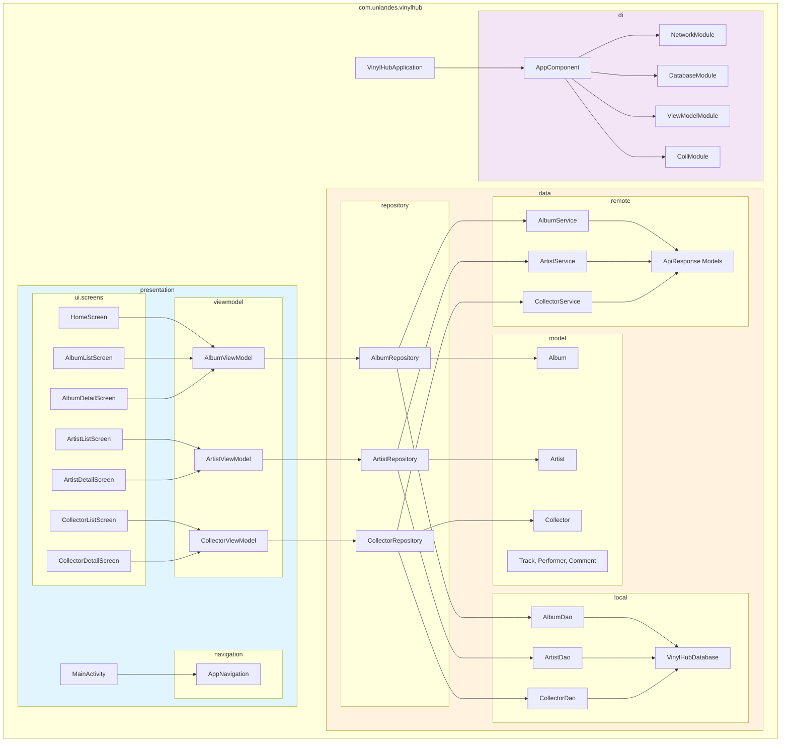

# Diagrama de Paquetes - Vinilos Mobile

## Estructura de Paquetes



## Descripción de Paquetes

### **presentation** (Capa de Presentación)
- **viewmodel/**: ViewModels que gestionan el estado de la UI
- **ui.screens/**: Composables de Jetpack Compose para cada pantalla
- **navigation/**: Configuración de navegación con Compose Navigation
- **MainActivity**: Actividad principal que contiene el NavHost

### **data** (Capa de Datos)
- **repository/**: Implementación del patrón Repository
- **remote/**: Servicios Retrofit para consumo de API REST
- **local/**: DAOs de Room para persistencia local
- **model/**: Modelos de dominio (Entities de Room)

### **di** (Inyección de Dependencias)
- **AppComponent**: Componente principal de Dagger 2
- **NetworkModule**: Provee Retrofit, OkHttp, Gson
- **DatabaseModule**: Provee Room Database y DAOs
- **ViewModelModule**: Provee ViewModels
- **CoilModule**: Provee ImageLoader para Coil

### **VinylHubApplication**
- Clase Application que inicializa Dagger 2

## Flujo de Datos

```
UI (Screens) 
    ↓ observa Flow
ViewModel 
    ↓ solicita datos
Repository 
    ↓ consulta API / Cache
Service (Retrofit) + DAO (Room)
    ↓ retorna datos
Repository 
    ↓ emite Flow
ViewModel 
    ↓ actualiza UI
UI (Screens)
```

