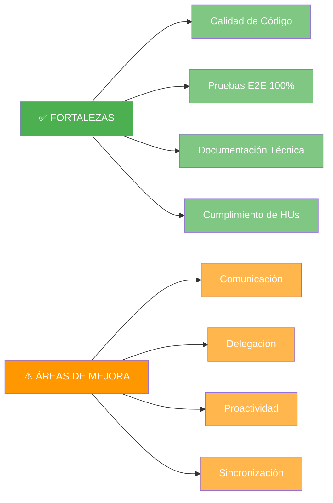

# Retrospectiva - Iteración 1

**Fecha:** 25 de octubre 2025  
**Sprint:** Iteración 1 (Semanas 3-4)  
**Equipo:** Grupo 13

---

## ✅ ¿Qué salió bien?

- **Calidad del código:** Arquitectura MVVM bien implementada con patrones claros
- **Pruebas E2E:** 17/17 pruebas exitosas (100% de cobertura de HUs)
- **Documentación técnica:** Diagramas arquitectónicos y estrategia de pruebas completos
- **Cumplimiento de funcionalidades:** 6/6 HUs implementadas según lo planeado
- **Stack tecnológico:** Integración exitosa de Kotlin, Compose, Retrofit, Room y Dagger

---

## ⚠️ ¿Qué se puede mejorar?

- **Comunicación del equipo:** Faltó mayor comunicación continua entre miembros durante el desarrollo
- **Delegación de responsabilidades:** Distribución desigual de tareas, con concentración de trabajo en algunos miembros
- **Proactividad:** Falta de iniciativa en algunos integrantes para tomar tareas sin asignación explícita
- **Sincronización:** Reuniones de seguimiento intermedias fueron insuficientes
- **Documentación temprana:** Actas y documentación se dejaron para el final del sprint

---

## 🎯 Acciones de mejora para próximas iteraciones

1. **Establecer daily standups** (async en Slack) para mejorar comunicación
2. **Distribuir tareas de forma más equitativa** desde el inicio del sprint
3. **Definir responsables y suplentes** para cada área técnica
4. **Fomentar proactividad** mediante tablero Kanban visible y actualizado
5. **Documentar en paralelo** al desarrollo, no al final
6. **Reuniones de seguimiento** a mitad de sprint (miércoles)

---

## 📊 Métricas

- **Puntuación final:** 96/100 (96%)
- **HUs completadas:** 6/6 (100%)
- **Pruebas exitosas:** 17/17 (100%)
- **Duración:** 2 semanas

---

## 💡 Lecciones aprendidas

- La calidad técnica es alta cuando hay claridad en la arquitectura
- Las pruebas E2E son fundamentales para validar funcionalidades
- La comunicación constante es tan importante como el código
- La distribución equitativa mejora el compromiso del equipo

---

## 📊 Análisis Visual

### Fortalezas vs Áreas de Mejora

